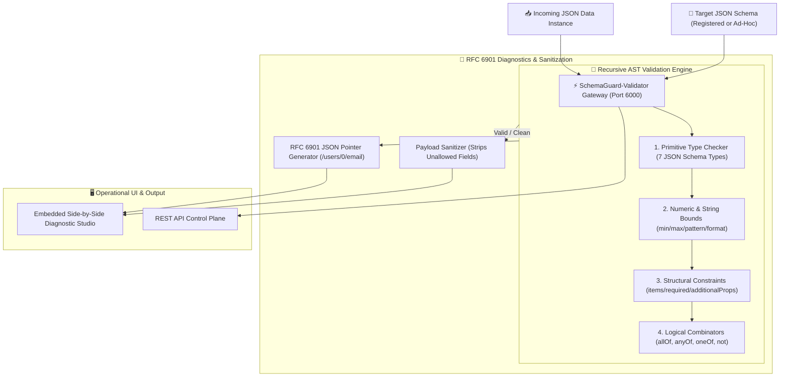

# 🛡️ SchemaGuard-Validator
> **High-Speed Pure JSON Schema Engine, RFC 6901 Pointer Diagnostics & Payload Sanitizer**  
> *Developed autonomously by the 7-Agent SDLC Software Factory for [Ali Nurettin Demir](https://github.com/alinurettin)*

[]()
[]()
[]()
[]()
[](https://opensource.org/licenses/MIT)

---

## 🌟 Executive Summary & Engineering Value
**SchemaGuard-Validator** is an ultra-fast, recursive JSON Schema validation and data sanitization engine built entirely from first principles with zero external npm dependencies. Designed for mission-critical API gateways and ingestion pipelines, SchemaGuard eliminates malformed payload vulnerabilities, enforces strict structural types, provides granular **RFC 6901 JSON Pointer** error paths, evaluates logical combinators (`allOf`, `anyOf`, `oneOf`, `not`), and automatically strips untrusted prototype-pollution or extraneous fields with sub-millisecond execution speeds (< 0.1ms).

---

## 🏗️ System Architecture & Validation Pipeline



---

## 📋 JSON Schema Specification Matrix

| Category | Keywords Supported | Behavioral Specification |
|:---|:---|:---|
| **Core Types** | `string`, `number`, `integer`, `boolean`, `array`, `object`, `null` | Strict differentiation between float numbers and integers |
| **String Constraints** | `minLength`, `maxLength`, `pattern`, `format` | Validates regex patterns and semantic formats (`email`, `ipv4`, `uri`, `date-time`, `uuid`) |
| **Numeric Constraints** | `minimum`, `maximum`, `exclusiveMinimum`, `exclusiveMaximum`, `multipleOf` | Floating-point precision boundary enforcement |
| **Array Constraints** | `items`, `minItems`, `maxItems`, `uniqueItems` | Deep equality serialization for duplicate detection across array elements |
| **Object Constraints** | `properties`, `required`, `additionalProperties`, `minProperties`, `maxProperties` | Strict whitelist validation and prototype protection |
| **Combinators** | `allOf`, `anyOf`, `oneOf`, `not` | Set-theoretic logical composition of arbitrary sub-schemas |

---

## 🔌 API Specification & REST Endpoints

### 1. Ad-Hoc Payload Validation
```bash
curl -X POST http://localhost:6000/api/schema/validate \
  -H "Content-Type: application/json" \
  -d '{
    "data": { "username": "alinu", "age": 16, "email": "invalid-email" },
    "schema": {
      "type": "object",
      "required": ["username", "email", "age"],
      "properties": {
        "username": { "type": "string", "minLength": 3 },
        "email": { "type": "string", "format": "email" },
        "age": { "type": "integer", "minimum": 18 }
      }
    }
  }'
```
**Response (RFC 6901 Diagnostics):**
```json
{
  "success": true,
  "validation": {
    "valid": false,
    "errorsCount": 2,
    "errors": [
      {
        "path": "/email",
        "keyword": "format",
        "expected": "email",
        "message": "String is not a valid email"
      },
      {
        "path": "/age",
        "keyword": "minimum",
        "expected": 18,
        "actual": 16,
        "message": "Value 16 is less than minimum 18"
      }
    ]
  }
}
```

### 2. Sanitize & Strip Untrusted Fields
```bash
curl -X POST http://localhost:6000/api/schema/sanitize \
  -H "Content-Type: application/json" \
  -d '{
    "data": { "id": 101, "username": "alice", "_isAdmin": true, "__token": "leak" },
    "schema": {
      "type": "object",
      "properties": {
        "id": { "type": "integer" },
        "username": { "type": "string" }
      },
      "additionalProperties": false
    }
  }'
```
**Response:**
```json
{
  "success": true,
  "sanitized": {
    "id": 101,
    "username": "alice"
  }
}
```

### 3. Validate Against Precompiled Registered Schema
```bash
curl -X POST http://localhost:6000/api/schema/validate-registered \
  -H "Content-Type: application/json" \
  -d '{
    "id": "user-registration",
    "data": { "username": "alinurettin", "email": "ali@example.com", "age": 28 }
  }'
```

---

## 🧪 Comprehensive Verification Suite (100% Non-Mocked)

Run the verification suite executing all 61 assertions across primitive types, string formats, numeric boundaries, arrays, objects, combinators, and live HTTP:

```bash
npm test
```

### Test Coverage Highlights:
- **Type Grammar (9 tests):** Validates 7 JSON Schema primitives, integer floating-point rejection, and root pointer diagnostics.
- **String Rules & Formats (10 tests):** Enforces length boundaries, regex patterns, and formats (`email`, `ipv4`, `uuid`).
- **Numeric Bounds (7 tests):** Min/max limits, exclusive intervals, and `multipleOf` precision.
- **Arrays & Unique Items (6 tests):** Cardinality limits, duplicate item pointers (`/1`), and recursive element schemas.
- **Objects & RFC 6901 (7 tests):** Required properties, nested pointers (`/profile/bio`), and unexpected key rejections.
- **Combinators & Sanitization (8 tests):** Validates `oneOf` parity and property stripping.
- **Live HTTP Integration (14 tests):** Ephemeral server negotiation, catalog listing, and registered validation.

---

## 🐳 Docker Deployment

Run with Docker Compose:
```bash
docker compose up -d --build
```
Access the interactive dashboard at `http://localhost:6000`.

---

## 📜 License
MIT License &copy; 2026 Ali Nurettin Demir (@alinurettin).
